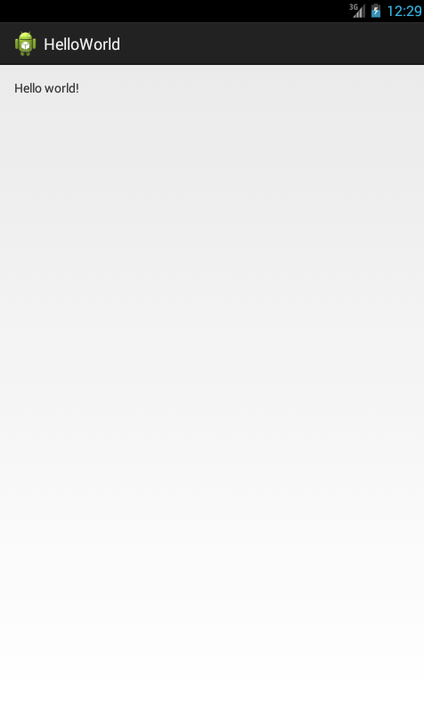
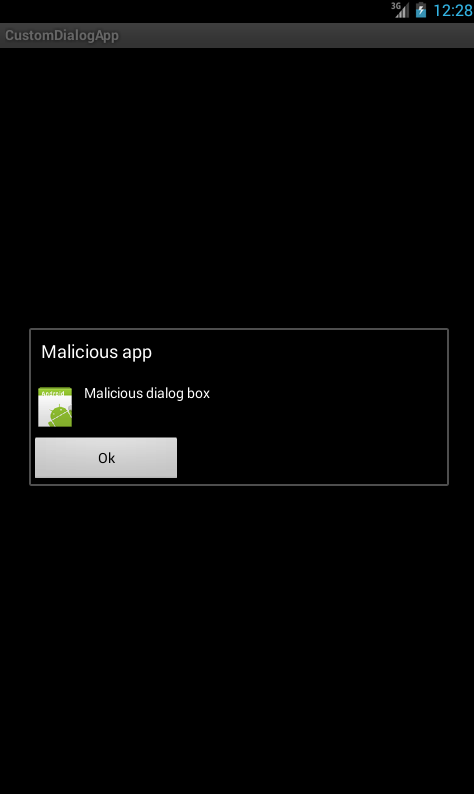
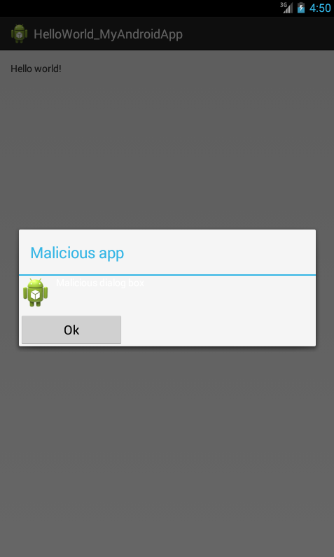

Merging two Android Applications
================================


Say there is App A (`HelloWorld`), with class files, A1.class, A2.class,
etc.

Now I write a malicious app (`MyAndroidApp`) called App B, with classes
B1.class, B2.class, etc.

There is a classic way of merging malicous app into App A. Its done by
simply copying the B\*.class files (with appropriate package paths) in
App A, and modifying the MANIFEST file.

This obfuscator would make the merging a lot deeper. It will merge
A\*.class and B\*.class to create new classes, say, AB\*.class.

So A1.class and B1.class is merged to create AB1.class; and so on.

There are a lot of challenges here. We still want App A to function as
it normally would. And App B to function as it normally would. 


## App A : HelloWorld

This application just displays a string HelloWorld.



```bash
HelloWorld
├── AndroidManifest.xml
├── assets
├── bin
│   ├── AndroidManifest.xml
│   ├── classes
│   │   └── com
│   │       └── example
│   │           └── helloworld
│   └── res
├── gen
│   └── com
│       └── example
│           └── helloworld
│               ├── BuildConfig.java
│               └── R.java
├── ic_launcher-web.png
├── libs
│   └── android-support-v4.jar
├── proguard-project.txt
├── project.properties
├── res
│   ├── drawable-hdpi
│   │   └── ic_launcher.png
│   ├── drawable-ldpi
│   ├── drawable-mdpi
│   │   └── ic_launcher.png
│   ├── drawable-xhdpi
│   │   └── ic_launcher.png
│   ├── drawable-xxhdpi
│   │   └── ic_launcher.png
│   ├── layout
│   │   └── activity_hello_world.xml
│   ├── menu
│   │   └── hello_world.xml
│   ├── values
│   │   ├── dimens.xml
│   │   ├── strings.xml
│   │   └── styles.xml
│   ├── values-sw600dp
│   │   └── dimens.xml
│   ├── values-sw720dp-land
│   │   └── dimens.xml
│   ├── values-v11
│   │   └── styles.xml
│   └── values-v14
│       └── styles.xml
└── src
    └── com
        └── example
            └── helloworld
                └── HelloWorld.java
```

Class HelloWorld
----------------
```java
package com.example.helloworld;

import android.os.Bundle;
import android.app.Activity;
import android.view.Menu;

public class HelloWorld extends Activity {

        @Override
        protected void onCreate(Bundle savedInstanceState) {
                super.onCreate(savedInstanceState);
                setContentView(R.layout.activity_hello_world);
        }

        @Override
        public boolean onCreateOptionsMenu(Menu menu) {
                getMenuInflater().inflate(R.menu.hello_world, menu);
                return true;
        }
        

}
```

## App B : MyAndroidApp

This application just displays a dialog box



```bash
MyAndroidApp
├── AndroidManifest.xml
├── assets
├── bin
│   ├── AndroidManifest.xml
│   ├── classes
│   │   └── com
│   │       └── mkyong
│   │           └── android
│   │               ├── BuildConfig.class
│   │               ├── MainActivity$1.class
│   │               ├── MainActivity.class
│   │               ├── R$attr.class
│   │               ├── R.class
│   │               ├── R$drawable.class
│   │               ├── R$id.class
│   │               ├── R$layout.class
│   │               └── R$string.class
│   └── res
├── gen
│   └── com
│       └── mkyong
│           └── android
│               ├── BuildConfig.java
│               └── R.java
├── proguard.cfg
├── project.properties
├── res
│   ├── drawable
│   │   └── ic_launcher.png
│   ├── drawable-hdpi
│   │   └── ic_launcher.png
│   ├── drawable-ldpi
│   │   └── ic_launcher.png
│   ├── drawable-mdpi
│   ├── drawable-xhdpi
│   ├── layout
│   │   ├── custom.xml
│   │   └── main.xml
│   └── values
│       └── strings.xml
└── src
    └── com
        └── mkyong
            └── android
                └── MainActivity.java
```

Class: MainActivity.java
------------------------

```java
package com.mkyong.android;

import android.app.Activity;
import android.app.Dialog;
import android.content.Context;
import android.os.Bundle;
import android.view.View;
import android.view.View.OnClickListener;
import android.widget.Button;
import android.widget.ImageView;
import android.widget.TextView;

public class MainActivity extends Activity {

    final Context context = this;

    public void onCreate(Bundle savedInstanceState) {

        super.onCreate(savedInstanceState);
        setContentView(R.layout.main);
        showDialog();

    }

    private void showDialog() {
        // custom dialog
        final Dialog dialog = new Dialog(context);
        dialog.setContentView(R.layout.custom);
        dialog.setTitle("Malicious app");

        // set the custom dialog components - text, image and button
        TextView text = (TextView) dialog.findViewById(R.id.text);
        text.setText("Malicious dialog box");
        ImageView image = (ImageView) dialog.findViewById(R.id.image);
        image.setImageResource(R.drawable.ic_launcher);

        Button dialogButton = (Button)
dialog.findViewById(R.id.dialogButtonOK);
        // if button is clicked, close the custom dialog
        dialogButton.setOnClickListener(new OnClickListener() {
            @Override
            public void onClick(View v) {
                dialog.dismiss();
            }
        });

        dialog.show();

    }

}
```


## Merging apps

### Renaming the base app

First of all lets make a replica of the app `HelloWorld` as
`HelloWorld_MyAndroidApp` before adding the code and xml from
`MyAndroidApp`. 


AndroidMainifest.xml
--------------------

The manifest presents essential information about the application to the
Android system, information the system must have before it can run any
of the application's code.

We are going to rename the app from `HelloWorld` to
`HelloWorld_MyAndroidApp`.  
from 
```xml
    android:name="com.example.helloworld.HelloWorld"
```
to
```xml
    android:name="com.example.helloworld.HelloWorld_MyAndroidApp"
```


res/values/strings.xml
----------------------
from
```html
<string name="app_name">HelloWorld</string>
```
to
```html
<string name="app_name">HelloWorld_MyAndroidApp</string>
```

### Copying methods from the malicious app

If the malicious app is using any custom layouts copy the corresponding 
xml files to `res/layout/` directory. 

Copying the user defined methods of the `MainActivity.java` of the
malicious app to the same of `HelloWorld_MyAndroidApp`.

So the final `HelloWorld_MyAndroidApp.java` looks like this:

```java
package com.example.helloworld;

import android.os.Bundle;
import android.app.Activity;
import android.view.Menu;
import android.app.Dialog;
import android.content.Context;
import android.view.View;
import android.view.View.OnClickListener;
import android.widget.Button;
import android.widget.ImageView;
import android.widget.TextView;

public class HelloWorld_MyAndroidApp extends Activity {

    final Context context = this;

        @Override
        protected void onCreate(Bundle savedInstanceState) {
                super.onCreate(savedInstanceState);
                setContentView(R.layout.activity_hello_world);
        showDialog();
        }

        @Override
        public boolean onCreateOptionsMenu(Menu menu) {
                // Inflate the menu; this adds items to the action bar
if it is present.
                getMenuInflater().inflate(R.menu.hello_world, menu);
                return true;
        }


    private void showDialog() {
        // custom dialog
        final Dialog dialog = new Dialog(context);
        dialog.setContentView(R.layout.custom);
        dialog.setTitle("Malicious app");

        // set the custom dialog components - text, image and button
        TextView text = (TextView) dialog.findViewById(R.id.text);
        text.setText("Malicious dialog box");
        ImageView image = (ImageView) dialog.findViewById(R.id.image);
        image.setImageResource(R.drawable.ic_launcher);

        Button dialogButton = (Button)
dialog.findViewById(R.id.dialogButtonOK);
        // if button is clicked, close the custom dialog
        dialogButton.setOnClickListener(new OnClickListener() {
            @Override
            public void onClick(View v) {
                dialog.dismiss();
            }
        });

        dialog.show();

    }
}  
```




PS: In-order to test the android applications you need to install 
[ADT](http://developer.android.com/sdk/index.html) on your machine.
